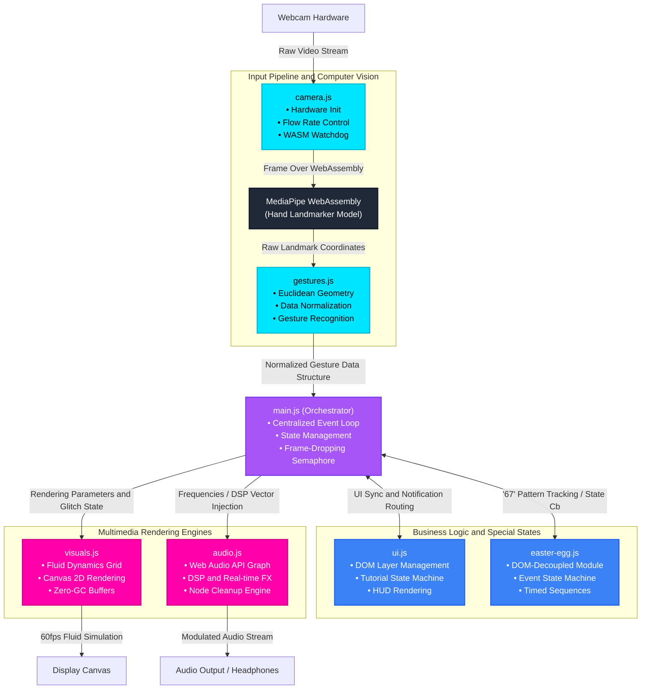

## Tame Impala Website Experience

Real-time interactive web application that combines computer vision, audio synthesis, and generative visual simulation in a browser environment.

## Link to the website: https://redkush01.github.io/Tame-Impala-Website-Experience/

The system explores gesture-driven interaction where user movement directly influences both visual and audio outputs in real time.

## Overview

This project is a browser-based interactive system designed around a continuous input-output loop:

- webcam input is processed for hand tracking

- gestures are translated into normalized control signals

- signals drive a visual simulation engine

- audio parameters are modulated in parallel. 
The focus is on low-latency interaction and system stability under continuous real-time input.

# Notes

This project is experimental and focuses on real-time interaction design, system responsiveness, and browser-based multimedia integration.
Hardware differences (CPU, GPU, camera quality) can affect computer vision performance and frame stability.

## Design Philosophy

The system is built around a real-time feedback loop architecture where input, processing, and output are continuously synchronized through a central orchestrator.

The primary constraint guiding the design is low-latency interaction under variable hardware conditions.

## Tech Stack

- Vanilla JavaScript (ES6+)

- MediaPipe Hands (computer vision)

- Web Audio API

- HTML5 Canvas

- CSS3 / HTML5

No external frameworks are used to maintain full control over rendering and execution flow.

## System Architecture

The application is divided into four independent modules:

Modules communicate through shared state updates and are designed to remain decoupled.


---

## Computer Vision Layer

MediaPipe Hands is used for real-time landmark detection from webcam input.

Detected landmarks are converted into normalized coordinates and used to derive:

-position data;

-motion vectors;

-gesture-based triggers. 


## Hardware Variability

Computer vision performance may vary depending on hardware capabilities, camera quality, and browser execution context. To mitigate instability, a simple frame control and watchdog mechanism is implemented to monitor processing delays and prevent pipeline stalls.


---

## Visual System

The visual engine is based on a grid-based simulation model:

- the screen is discretized into a 2D field;

- each cell stores velocity and density values;

-user input injects forces into the field;

-values propagate over time using iterative updates;

The system is optimized to minimize unnecessary memory allocation during the render loop.


---

## Audio System

The audio engine is built using the Web Audio API graph model.

It includes:

- gain control nodes;

- delay and reverb effects;

- low-frequency oscillation for modulation (high pass and low pass filters);

- stereo spatialization. 

Audio parameters are continuously updated based on gesture intensity and movement dynamics.


---

## Performance Strategy

The application is designed for stable real-time execution (~60fps).

Key implementation strategies include:

- frame-dropping mechanism to prevent input backlog;

- watchdog logic for MediaPipe processing stability;

- preallocated buffers to reduce garbage collection overhead;

- modular separation of concerns across subsystems. 


The design prioritizes consistent latency over maximum visual complexity.


---

## Interaction Model

The system operates as a continuous loop:

1. webcam input is processed in real time;

2. gesture data is extracted and normalized;

3. visual simulation responds to input forces;

4. audio graph is modulated accordingly. 

Interaction is state-driven and continuously updated per frame.


---

## Running the Project

1. Clone repository:
```bash
git clone https://github.com/Redkush01/Tame-Impala-Website-Experience
```
2. Start a local server:
```bash
npx serve
```
3. Open the project in a browser and allow camera permissions.


## Credits

Music by Tame Impala
All music rights belong to Kevin Parker.
